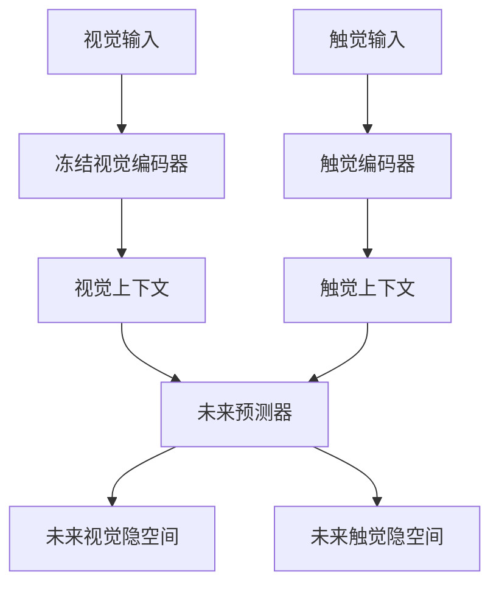
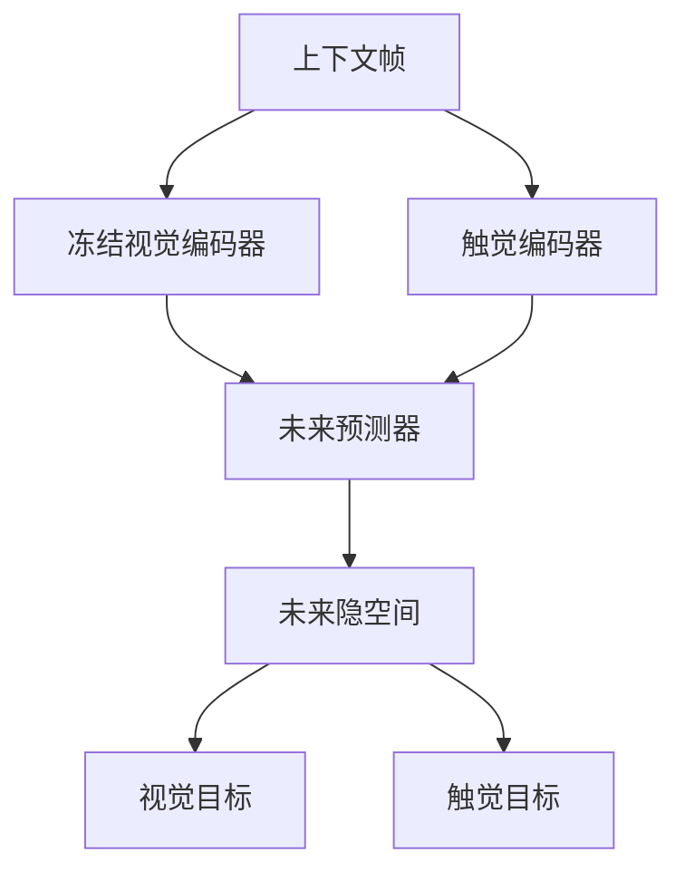

# 基于 V-JEPA 2.1 隐空间的视触世界模型

## 目标

**冻结**预训练好的 V-JEPA 2.1 视觉编码器，把它最后一层 token 当作视觉世界的时空隐空间。只新训两个模块：

1. **触觉编码器**：tubelet ViT，把凝胶图 / taxel 观测映射到与 V-JEPA 相同的时间网格上，输出空间 token，而不是一个全局池化向量。
2. **未来隐空间预测器**：history-only 的 JEPA 风格 Transformer。以历史视觉、触觉 token 和可选本体状态为观测，输出稀疏未来 waypoint（例如 `t+5,...,t+30`）的 **V-JEPA 视觉隐空间**，以及 **触觉编码器隐空间**。它不接收 π0.5 action chunk；未来 latent 是给 π0.5 action expert 的行为引导。

视觉编码器是教师。这套结构不替代 V-JEPA 的时空建模能力，预测器的回归目标就是这块隐空间。

## 旧设计为什么达不到这个目标

| 模块 | 旧设计 | 问题 |
|---|---|---|
| 触觉编码器 | 逐帧 ResNet-18，32× 下采样 | 没有时间核；接触建立/断开、滑移是动态过程，不是静图。下采样过猛会毁掉凝胶几何。 |
| Token 布局 | 预测器和 JEPA 损失里立刻对空间维 `mean()` | V-JEPA 的隐空间是 `T x H x W` token 网格，平均掉等于丢掉要复用的东西。 |
| 视觉特征 | 对 V-JEPA 2.1 走 `training=True` | 该模式下会把多层特征拼起来，那是预训练头，不是世界模型要用的最后一层 latent。 |
| 预测器 | 池化后的 `[B, T, D]` Transformer | 只能出一段 clip 向量，给不出未来的 *token 网格*。 |
| 接口残留 | `patch_size` 未使用、文档仍写「strided conv」、测试按 ViT token 断言 | 图像通路已经从 patch tokenizer 漂到了 ResNet。 |

## 架构



数据流：视觉历史 / 当前触觉观测 → 冻结 V-JEPA 与可训练触觉 ViT → 上下文 token `z_v`、`z_h(t)` → 预测器 → 未来 N 帧 `hat z_v`（V-JEPA 空间）和 `hat z_h`。视觉和状态可以保留多帧历史；触觉 context 固定为边界时刻的单帧，以便在线低延迟编码。训练中的触觉 target 也逐帧用单帧时间上下文编码，避免 target encoder 看到未来触觉帧。

默认 `align` 阶段不微调 V-JEPA。可选的 `joint` 阶段以 0.1× 学习率解冻视觉编码器；预测目标始终是视觉编码器的 EMA 副本。

### 触觉编码器

归纳偏置与 V-JEPA 相同，容量更小：

```
图像  [B,T,C,H,W]
    → （可选空间 resize）
    → Conv3d tubelet  （核 = (tubelet, patch, patch)）
    → Transformer blocks  （V-JEPA 2.1 Block，3D RoPE）
    → LayerNorm
    → [B, T/tubelet, (H/patch)*(W/patch), D_h]

向量  [B,T,F]
    → 对每个 tubelet 内的帧做 Linear
    → 同一套 Transformer，作用在 T 个 token 上
    → [B, T/tubelet, 1, D_h]

taxel 网格 [B,T,H*W]
    → reshape 成 1 通道图像，再走图像通路
```

训练目标的触觉编码器可以使用和 V-JEPA 相同的 tubelet 网格；当前训练入口为了匹配部署时的“单帧 GelSight 观测”，明确使用 `tactile.tubelet_size=1`，并在未来 raw-frame 时间点取目标。视觉 tubelet 大于 1 时，配置里的 waypoint 必须仍落在视觉 latent 网格上。默认 `embed_dim=384`、`depth=6`，足够刻画凝胶形变，远小于 ViT-L。

不再提供 ResNet-18。32× 分类骨干不适合 token 级世界模型。

### 预测器

这是 V-JEPA 的 *mask-token* 预测器，扩展到两个模态。

每一帧的上下文序列是 `[触觉 token | 视觉 token | 可选状态 token]`。上下文窗口之后，为每个 future waypoint 追加一组可学习 query，并加上：

- 共享时间编码（上下文 `0..C-1`，未来 `C..C+N-1`）
- 分模态的空间编码（若初始化时不知道网格大小，则线性插值）
- 模态编码

序列最末端再追加 `n` 个 **condition query**（默认 16）。它们只有可学习身份向量和第三种 modality 编码，**没有**时间/空间位置。注意力顺序是：

```
[触觉 context | 视觉 context | 可选 state | 未来触觉 query | 未来视觉 query | condition query × n]
```

注意力是 prefix encoder-decoder，不是整段双向：

- **context（encoder）**：只在历史 token 之间互看，看不见任何 query
- **未来视触 query（decoder）**：彼此自注意力，并 cross-attend context；看不见 condition
- **condition query**：可以看整条序列（包括彼此），但 context / 未来格子看不到它们

因此历史编码不会混进 “我在问 t+k” 的槽位身份；JEPA 的 `pred_visual` / `pred_tactile` 也不会被 condition query 改写。同一套 V-JEPA 2.1 `Block`，用注意力 mask 实现，**并行**预测所有未来 token。这里不用 RoPE：视觉和触觉的空间网格不同，而 V-JEPA 的 RoPE 假定只有一套 `T x H x W` 格子。加法位置编码可以分别对齐两套网格。

输出：

- `pred_visual`：`[B, K, N_v, D_v]` — 与冻结编码器同一套网格，`K=len(future_offsets)`
- `pred_tactile`：`[B, K, N_h, D_h]`
- `condition`：`[B, n, D_c]` — 给下游 flow matching / action expert 的短条件序列；`D_c` 默认等于 `predictor_dim`，可设成 expert 隐宽。`n=0` 时为 `None`

不做空间 `mean()`。未来视觉张量可以直接当作 V-JEPA latent，接到已经消费 V-JEPA token 的模块上（attentive pooler、AC planner、读出头）。`condition` 才是给 π0.5 action expert 的接口；训练 FM 时应冻结 predictor 主干，只训 `condition_query` / `out_condition` 和 expert。



## 损失

主信号在未来窗口上，**token 级**：

```
L_future = λ_v * MSE( normalize(ẑ_v), normalize(z_v_target) )
         + λ_h * MSE( normalize(ẑ_h), normalize(z_h_ema) )
```

其中：

- `ẑ_v` / `ẑ_h`：预测器输出的未来视觉 / 触觉 token
- `z_v_target`：冻结 V-JEPA 在未来帧上的最后一层 token（stop-grad）
- `z_h_ema`：触觉编码器 EMA 在未来帧上的 token（stop-grad）
- `normalize`：对最后一个通道做 L2 归一化，等价于余弦距离
- `λ_v`、`λ_h`：配置里的 `lambda_future_visual`、`lambda_future_tactile`

辅助信号在上下文窗口上，**帧级**（相机和凝胶没有共享空间格子，所以只对空间维池化）：

- 当前单帧触觉与同一时间点视觉摘要之间的 InfoNCE
- 这些摘要的余弦 / MSE
- 一阶时间差分一致性

对齐头里视觉张量是 detach 的，V-JEPA 始终当教师。

两个阶段：

| 阶段 | 训练什么 | 冻结什么 | 目的 |
|---|---|---|---|
| `align` | 触觉编码器 + 对齐头 | V-JEPA，预测器不用 | 让触觉 token 的时间网格跟视觉一起动 |
| `joint` | 触觉编码器 + 预测器；配置 `joint_unfreeze_visual: true` 时才以 0.1× lr 解冻视觉 | V-JEPA 目标 EMA | 真正预测未来隐空间 |

`align` 结束后用它的 checkpoint 启动 `joint`。默认 joint 仍冻结视觉 teacher；机器人数据量足够、并且确认视觉域偏移明显时，再把 `joint_unfreeze_visual` 打开。

## 张量约定

以 ViT-L/16、`crop_size=256`、`tubelet_size=1`、`context=8`、`horizon=4`，触觉 `img_size=224`、`patch_size=16`、`embed_dim=384` 为例。

| 张量 | 形状 |
|---|---|
| 视觉输入 | `[B, 3, 12, 256, 256]` |
| 触觉输入 | `[B, 12, 3, 224, 224]` |
| `z_v` | `[B, 12, 256, 1024]` |
| `z_h` | `[B, 12, 196, 384]` |
| 预测器上下文 | `z_v[:, :8]`，`z_h[:, :8]` |
| `ẑ_v` | `[B, 4, 256, 1024]` |
| `ẑ_h` | `[B, 4, 196, 384]` |
| `condition` | `[B, 16, 512]` |

若 V-JEPA checkpoint 的 `tubelet_size=2`，视觉隐空间时间长度变成 `12/2 = 6`；当前单帧触觉部署路径仍保持触觉编码器 tubelet 为 1，并用对应 raw-frame endpoint 对齐视觉未来 waypoint。若要让触觉本身也使用 tubelet=2，需要同时改造 trainer 的在线单帧输入协议。

## 为什么这样用 V-JEPA 2.1 是合理的

- **被预测的就是 V-JEPA 的隐空间。** 未来视觉 token 的 `N_v`、`D_v` 与冻结编码器一致。这正是 2.1 学出来的稠密、时间一致表征（最后一层，不是预训练时的多层拼接）。
- **触觉是额外观测，不是替代编码器。** 它是一个小 ViT，用同样的 tubelet / RoPE block，才能和预测器说同一种「按时间排开的 token」语言。
- **预测器沿用 V-JEPA 的预测范式**（可见上下文 + 缺失区域的 mask token）。这里的「缺失区域」定义成 *未来时间* 而不是空间掩码，并且每帧交错第二种模态。这更接近 V-JEPA 2-AC（在隐空间上的世界模型），而不是 CLIP 式的池化头。
- **容量放对了地方。** ViT-L 保持冻结。新模块是 depth-6 / width-384–512，匹配机器人视触数据量。

这套东西**不是**：从零预训练一个视触 JEPA，也**不是**带动作条件的策略。它输出 history-only 的 latent plan，供外部 π0.5 action expert 使用；本体状态已作为可选 context token 接口加入。

## 训练

Manifest 为 JSONL，每行一个 clip：

```json
{"vision": "episodes/episode_000000_vision.npy", "tactile": "episodes/episode_000000_tactile.npy", "state": "episodes/episode_000000_state.npy", "action": "episodes/episode_000000_action.npy"}
```

数组形状为 `[T, C, H, W]`（向量触觉则为 `[T, F]`），长度至少 `n + m`。

manifest loader 默认把非负的 uint8 / 0–255 图像转成 `[0,1]`，调整到 `crop_size`，并做 V-JEPA 使用的 ImageNet mean/std 归一化；如果已经在外部完成预处理，可在配置中设置 `normalize_vision: false` 并传入自己的 transform。

n（观测帧）和 m（预测帧）只写在 yaml 里，不写死在代码中：

```yaml
context: 4     # n，历史视触帧；别名 input_frames
horizon: 30    # m，数据窗口的最大未来长度；别名 output_frames
visual_tubelet_size: 2
future_offsets: [6, 10, 16, 20, 26, 30]  # raw-frame offsets on the tubelet grid
random_future_offsets: true
random_future_count: 6
joint_unfreeze_visual: false
seed: 0
```

启用 `random_future_offsets` 后，每个训练 batch 都会用该 seed 驱动独立随机数生成器，从 `tubelet_size..horizon`（按 tubelet 网格）采样 6 个不同时间点；checkpoint 会保存随机状态，续训不会重复采样序列。推理时通过 `predictor(..., future_offsets=[...])` 显式指定时间点。

改这两个数后，数据窗口、编码器最大帧数、预测器 query 数都会跟着变。n、m 必须能被 `tubelet_size` 整除。`4 → 30` 的 token 序列较长，显存不够就降低 `batch_size`。

LeRobot v3 可以作为原始数据格式，但本训练器当前读取的是上面的 JSONL manifest（每个 episode 一个 `.npy` 序列）。可以先转换：

```bash
python -m app.vjepa_2_1.convert_lerobot \
  --repo-id your-org/your-dataset \
  --root /data/your-dataset \
  --vision-key observation.images.front \
  --tactile-key observation.images.gelsight \
  --state-key observation.state \
  --action-key action \
  --max-episodes 4 \
  --output /data/vjepa_manifest
```

转换后的 `manifest.jsonl` 填入 `configs/train_2_1/tactile_alignment.yaml` 的 `manifest`。视觉和 GelSight 必须有相同的帧率、episode 边界和时间顺序；当前默认配置启用 8 维 `state`（7 维 `vio_pose` + 1 维 `gripper`），因此每条 manifest 记录都必须包含 state 路径。若改回 `state.dim: null` 才可省略状态。LeRobot 的 `action` 会被保留，当前 latent trainer 不直接使用它，后续可用于训练残差控制器。

对于 VT-UMI 原始目录（每个 `episode_*/left_hand` 下有 `rgb.mp4`、
`tactile_left.mp4`、`tactile_right.mp4`），可直接转换，无需安装 LeRobot：

```bash
python -m app.vjepa_2_1.convert_lerobot \
  --format umi \
  --root /home/lry/data/VT_UMI/fast_umi_data_sync_0324 \
  --output /home/lry/data/VT_UMI/fast_umi_manifest \
  --include-state
```

两个指间触觉视频会按水平方向拼接，保留为一个 3 通道触觉帧；使用
`left_hand/vio_pose.npy` 与 `left_hand/gripper.npy` 按特征维拼接后导出为 `state`。
当前默认 `state.dim: 8`（7+1）；如果数据中的数组维度不同，请按拼接后的最后一维调整配置。
先在数据准备环境安装 `lerobot`。转换后视觉数组应为 `[T,3,H,W]`，GelSight 为 `[T,C,H,W]`（灰度传感器把 `tactile.in_channels` 设为 1），本体状态为 `[T,D]`，action 为 `[T,A]`；`T` 必须至少是 `context + horizon`。

训练参数（阶段、V-JEPA checkpoint、resume checkpoint、输出目录）都放在
`configs/train_2_1/tactile_alignment.yaml` 的 `training` 节中。日常运行只需传配置：

```bash
python -m app.vjepa_2_1.train_tactile_alignment \
  --config configs/train_2_1/tactile_alignment.yaml
```

第一阶段将 `training.stage` 设为 `align`、`training.resume: null`；完成后将其改为
`joint` 即可。joint 会在 `training.output.align` 里按 `metrics.json` 的最低 loss
自动选 checkpoint（没有 loss 记录则用最新的 `checkpoint_XXXX.pt`）。
`training.output.align` 与 `training.output.joint` 分开写，换阶段不必改输出目录。
若 `name` 或 `name(n)` 已存在，新的一次训练写到 `name(max+1)`，例如已有 `(1)` 则建 `(2)`。
默认每 `training.save_every`（10）个 epoch 存一次，最后一个 epoch 也会存。
学习率是线性 warmup（`optimization.warmup_epochs`）再余弦退火到
`min_lr_scale *` 峰值 lr；触觉编码器和预测器共用同一条倍率曲线。
命令行仍支持用 `--resume` 指定路径或 `auto`。

训练前按 `seed` 把 manifest clip 随机划成训练集和验证集（默认 `val_ratio: 0.2`），
划分结果写在输出目录的 `split.json`。TensorBoard 曲线在
`training.output.<stage>/tensorboard`，同一指标的 `.../train` 与 `.../val` 会叠在一张图上。
训练结束时会读取这些日志，把全部曲线渲染成 PNG，保存在同级的 `curves/` 目录。

```bash
tensorboard --logdir /home/lry/data/jepa/outputs/tactile_align/tensorboard
```

代码对应关系：

- `app/vjepa_2_1/models/tactile_encoder.py` — tubelet ViT
- `app/vjepa_2_1/models/multimodal_predictor.py` — 未来 token 预测器
- `app/vjepa_2_1/models/tactile_alignment.py` — 帧级辅助损失
- `app/vjepa_2_1/train_tactile_alignment.py` — 训练循环、EMA、两阶段
- `configs/train_2_1/tactile_alignment.yaml` — 默认超参

## 有限验证与可视化

训练目标全在隐空间里，没有像素解码器，所以不要等 RGB 重建。有限、直观的检查是：**把 token 网格画出来**，再和两条笨基线比。

| 看什么 | 怎么看 | 训练有效时应该怎样 |
|---|---|---|
| PCA 伪彩图 | 对 V-JEPA / 触觉 token 做 3 主成分，当成 RGB，按空间网格铺开 | 预测的未来 PCA 图应接近 GT：物体边界、接触位置跟着动，而不是糊成一片 |
| 空间误差热力图 | 每个空间 token 的 `1 - cosine(pred, target)` | 背景低误差，接触/运动区域略高；整图全红说明没学到 |
| 打过「复制最后一帧」 | 用上下文最后一格 token 填满未来，算逐步余弦 | 预测余弦应高于 copy-last，且随 horizon 掉得更慢 |
| 帧级视触对齐 | 上下文里 `z_v`、`z_h` 池化后的余弦随时间 | `align` 之后应对齐且平滑，不同步则编码器有问题 |

V-JEPA 2.1 论文/README 里的彩色特征图就是 PCA。这里把同一套颜色基拟合在 **GT token** 上，再投影到 **预测 token**，两边才能直接对比。

```bash
python -m app.vjepa_2_1.visualize_latents \
  --config configs/train_2_1/tactile_alignment.yaml \
  --vjepa-checkpoint /path/to/vjepa2.1.pt \
  --resume outputs/tactile_joint/checkpoint_0050.pt \
  --output outputs/tactile_vis \
  --num-clips 4
```

每个 clip 会写出：

- `clip_XXX.png`：每一行是一帧。从左到右依次为 **视觉 RGB | 视觉 GT PCA | 视觉预测 PCA | 视觉误差 | 触觉图 | 触觉 GT PCA | 触觉预测 PCA | 触觉误差**。上下文帧的预测两列是黑的（还没有未来预测）。
- `clip_XXX.json`：每个未来步的预测余弦 vs copy-last。
- `summary.json`：全部 clip 汇总。

怎么读图：

1. 先看 GT PCA 是否已经有结构（手、物体、凝胶接触斑）。若 GT 本身就是噪声，问题在 V-JEPA 前向或数据对齐，不是预测器。
2. 再看预测 PCA 是否跟上 GT 的运动，而不是停在上下文最后一帧。
3. 误差图应随时间变亮一点，但不应整幅爆红。
4. JSON 里 `visual_beats_copy_last` / `tactile_beats_copy_last` 应为 true。若 loss 在降但打不过 copy-last，模型多半在学恒等，没有学动力学。

这还不是策略评估。有标注之后可以再加线性探针（接触/滑移/物体类别）；需要像素时再单独训一个轻量 decoder，不要和世界模型绑在一起。

## 推理示意

一次 `forward` 的输入是 **历史 `context`（n）帧视觉/状态和边界时刻单帧触觉**，输出由 `future_offsets` 指定的稀疏未来隐空间。例如配置 `context: 4`、`horizon: 30`、`tubelet_size: 2`、`future_offsets: [6,10,16,20,26,30]` 是 4 进 6 个 waypoint；`horizon` 仍表示数据窗口最大未来长度。训练入口接收 raw-frame offset，直接调用 predictor 时要除以视觉 tubelet。

```python
zv = visual_tokens[:, :context // tubelet]   # 冻结 V-JEPA，[B, C/tubelet, Nv, Dv]
zh = tactile_encoder(tac[:, context - 1:context])  # 当前单帧，[B, 1, Nh, Dh]
raw_offsets = (6, 10, 16, 20, 26, 30)
z_v_hat, z_h_hat, cond = predictor(
    zv, zh, state,
    future_offsets=[x // tubelet for x in raw_offsets],
)  # [B, 6, Nv, Dv], [B, 6, Nh, Dh], [B, 16, Dc]
# cond is the flow-matching prefix: extra tokens for the action expert
```

训练时已经把 m 写成 30，推理就直接 `forward`，不要再用 rollout 拼 30 帧。`rollout` 只用于比训练 m 更长的外推，误差会累积。

在线触觉纠正只把尚未执行的动作传给残差控制器。假设第 10 个 raw-frame waypoint 到达：

```python
from app.vjepa_2_1.models import LatentResidualController

controller = LatentResidualController(latent_dim=Dh, action_dim=action_dim)
remaining = controller.correct_at(
    z_h_hat,                         # [B, 6, Nh, Dh]
    tactile_encoder(tactile_now),    # [B, 1, Nh, Dh]
    action_chunk[:, 10:],            # 仅作为被加残差的 suffix；MLP 不吃动作
    elapsed_offset=10,
    future_offsets=(6, 10, 16, 20, 26, 30),
)
```

这个 MLP 需要用真实机器人数据训练（目标是未来动作或动作残差）；随机初始化的控制器只能验证张量接口，不能直接部署。
有成对的 `target_actions` 时可用 `controller.training_loss(predicted, observed, remaining, target_actions)` 做监督训练。

## 局限和自然的下一步

- 相机和凝胶不共享像素，所以对齐只能做帧级。若要让辅助损失也有空间意义，需要学一个视触对应（例如 cross-attention pooling）。
- 预测器不接收动作条件，这是有意的：它生成供 π0.5 使用的未来 latent plan。动作 residual controller 属于外部闭环模块。
- 这也意味着它不是严格的 action-conditioned dynamics model：同一历史下不同动作不会产生不同未来 latent。接触动力学强依赖动作时，应在数据和显存允许后把候选 action chunk 作为 predictor token 或改成 action-conditioned predictor，并用闭环 rollout 训练。
- 并行 N 帧解码不等于自回归 rollout。若长时域规划需要，可加帧级因果 mask，并做一步展开训练。
- 触觉 `img_size` 目前是方形 resize。凝胶图若是 240×320 且标记几何重要，应改成保纵横比（letterbox）。
- V-JEPA 2.1 最后四层的分层拼接**有意不用**作世界模型状态。如果某个读出头需要那些稠密特征，应另开一次冻结前向，不要从本预测器取。
